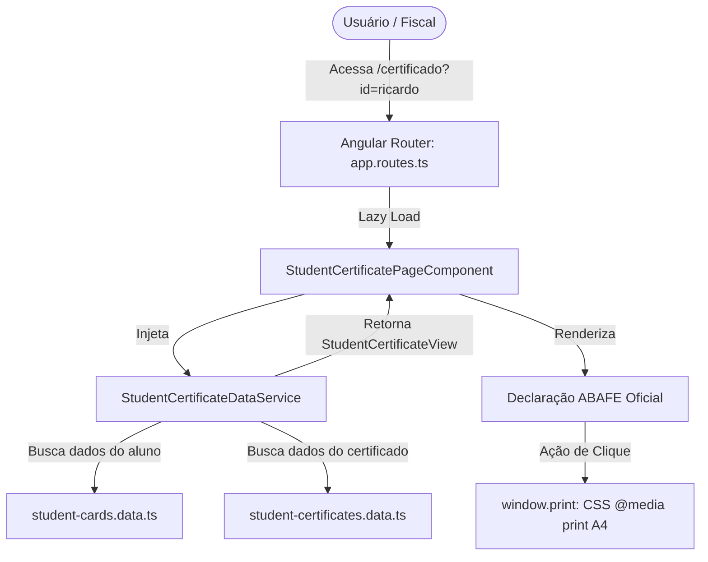

# Especificação Técnica: Página de Certificação e Autenticidade

## Resumo Executivo

Esta especificação técnica orienta a implementação da página de certificação e declaração de autenticidade da Carteira de Identidade Estudantil (CIE) digital no projeto `carteirinha-estudantil`. A solução é baseada no frontend estático existente em **Angular 22** (Standalone Components, Signals e OnPush), provendo uma rota direta `/certificado?id={studentId}` para atestar formalmente a matrícula e a regularidade jurídica do estudante.

O design implementará com fidelidade milimétrica o modelo documental oficial da ABAFE (`7f347123ae1e758fb2d9-cert-4c7564b9-1780449475225.pdf`), agregando dados cadastrais existentes de **Ricardo** e **Jenifer**, exibindo a chave pública criptográfica ICP-Brasil em formato PEM e permitindo o download/impressão nativa em formato A4 perfeitamente diagramado via `@media print`.

## Arquitetura do Sistema

### Visão Geral dos Componentes

- **Frontend (Angular 22)**:
  - `StudentCertificatePageComponent`: componente de página standalone responsável pela captura reativa do parâmetro `id` da query string, consulta dos dados do aluno e certificado, tratamento de erros e acionamento da rotina de impressão/PDF.
  - `StudentCertificateDataService`: serviço responsável por correlacionar os dados cadastrais do aluno (`StudentCardData`) com as credenciais criptográficas do certificado (`StudentCertificateData`).
  - `student-certificates.data.ts`: repositório estático com os metadados de autenticidade e chaves ICP-Brasil.
  - `student-certificate.model.ts`: interfaces de tipagem TypeScript para certificado e agregação de dados.
  - `app.routes.ts`: definição de roteamento SPA com rota lazy-loaded `/certificado`.
- **Backend (Spring Boot)**: Não aplicável. Aplicação 100% estática executada no navegador.
- **API REST**: Não aplicável. Sem dependência de tráfego HTTP remoto.
- **Banco de Dados**: Não aplicável. Dados compilados estaticamente no bundle do cliente.



## Design de Implementação

### Frontend (Angular)

#### Componentes

Componente de página principal localizado em `src/app/student-cards/pages/student-certificate-page/`:

```typescript
@Component({
  selector: 'app-student-certificate-page',
  standalone: true,
  imports: [CommonModule],
  templateUrl: './student-certificate-page.component.html',
  styleUrl: './student-certificate-page.component.scss',
  changeDetection: ChangeDetectionStrategy.OnPush,
})
export class StudentCertificatePageComponent {
  private readonly route = inject(ActivatedRoute);
  private readonly certificateService = inject(StudentCertificateDataService);

  readonly requestedId = signal(this.route.snapshot.queryParamMap.get('id'));
  readonly certificateView = computed(() =>
    this.certificateService.getCertificateByStudentId(this.requestedId())
  );
  readonly photoFailed = signal(false);

  onPhotoError(): void {
    this.photoFailed.set(true);
  }

  printCertificate(): void {
    window.print();
  }
}
```

#### Services

Serviço `StudentCertificateDataService` em `src/app/student-cards/services/student-certificate-data.service.ts`:

```typescript
@Injectable({ providedIn: 'root' })
export class StudentCertificateDataService {
  private readonly cardService = inject(StudentCardDataService);

  getCertificateByStudentId(studentId: string | null): StudentCertificateView | null {
    if (!studentId) {
      return null;
    }
    const card = this.cardService.findById(studentId);
    if (!card) {
      return null;
    }
    const certMeta = STUDENT_CERTIFICATES[studentId];
    if (!certMeta) {
      return null;
    }
    return { card, certificate: certMeta };
  }
}
```

#### Models/Interfaces

Arquivo `src/app/student-cards/models/student-certificate.model.ts`:

```typescript
import { StudentCardData } from './student-card.model';

export interface StudentCertificateData {
  studentId: string;
  authHash: string;
  certificateKey: string;
  issuedAt: string;
  city: string;
  legalFramework: string;
}

export interface StudentCertificateView {
  card: StudentCardData;
  certificate: StudentCertificateData;
}
```

Base de dados em `src/app/student-cards/data/student-certificates.data.ts`:
Conterá as chaves X.509 completas no padrão ICP-Brasil (extraídas do documento oficial modelo da ABAFE) vinculadas às chaves `ricardo` e `jenifer`.

#### Rotas

Configuração atualizada em `src/app/app.routes.ts`:

```typescript
import { Routes } from '@angular/router';

export const routes: Routes = [
  {
    path: '',
    loadComponent: () =>
      import('./student-cards/pages/student-card-page/student-card-page.component').then(
        (m) => m.StudentCardPageComponent,
      ),
  },
  {
    path: 'certificado',
    loadComponent: () =>
      import('./student-cards/pages/student-certificate-page/student-certificate-page.component').then(
        (m) => m.StudentCertificatePageComponent,
      ),
  },
  {
    path: '**',
    redirectTo: '',
  },
];
```

#### Estilos e Regras de Impressão (`@media print`)

O SCSS do componente implementará a fidelidade visual com o modelo da ABAFE:
1. **Banner Superior**: Fundo verde `#00e676` (com contraste ideal e texto `#004d40` ou `#ffffff` dependendo da luminância, espelhado do documento).
2. **Card Central**: Borda suave `#e0e0e0`, `border-radius: 12px`, foto em proporção 3x4 à esquerda com código CIE logo abaixo, campos em duas colunas (`Instituição`, `Curso`, `CPF`, `Data de Nascimento`, `Emissor`), e imagem do QR code posicionada à direita.
3. **Chave PEM**: Bloco `<pre>` com `font-family: monospace`, tamanho de fonte reduzido (`11px`), quebra de palavras automática (`overflow-wrap: anywhere; word-break: break-all;`) e cor `#4a5568`.
4. **Regras de Impressão**:
   ```scss
   @media print {
     @page {
       size: A4 portrait;
       margin: 15mm 18mm;
     }

     :host {
       background: #ffffff !important;
       color: #000000 !important;
     }

     .no-print,
     .download-btn {
       display: none !important;
     }

     .cert-container {
       box-shadow: none !important;
       max-width: 100% !important;
       padding: 0 !important;
     }

     .cert-card,
     .cert-footer {
       break-inside: avoid;
     }
   }
   ```

### Backend (Spring Boot)

#### Controllers
Não aplicável. O projeto é um frontend estático hospedado na Vercel.

#### Services
Não aplicável. Toda a lógica de negócio e resolução reside no cliente Angular.

#### Entities
Não aplicável. Não existem entidades JPA ou persistência relacional.

#### Repositories
Não aplicável. Sem persistência via banco de dados.

#### DTOs (Records)
Não aplicável. As trocas de dados são mediadas por interfaces TypeScript locais.

### API REST

#### Endpoints
Nenhum endpoint REST é criado ou consumido.

| Método | Endpoint | Descrição | Request | Response |
|---|---|---|---|---|
| - | - | Não aplicável para aplicação estática | - | - |

#### Schemas de Request/Response
Não aplicável.

### Banco de Dados

#### Schema
Não aplicável. Os registros são mantidos estaticamente em constantes imutáveis do TypeScript.

#### Migrations
Não aplicável.

#### Relacionamentos
A relação de dados é lógica no TypeScript: `STUDENT_CERTIFICATES[studentId]` indexa diretamente o `id` presente em `STUDENT_CARDS`.

## Abordagem de Testes

### Testes de Unidade (Backend)
Não aplicável.

### Testes de Integração (Backend)
Não aplicável.

### Testes de Componente (Frontend)

Criação dos testes em `src/app/student-cards/pages/student-certificate-page/student-certificate-page.component.spec.ts` e `src/app/student-cards/services/student-certificate-data.service.spec.ts`:

1. **`StudentCertificateDataService`**:
   - Deve retornar dados agregados válidos para `id=ricardo` com chave ICP-Brasil e dados do cartão.
   - Deve retornar dados agregados válidos para `id=jenifer`.
   - Deve retornar `null` para identificador inexistente ou nulo.
2. **`StudentCertificatePageComponent`**:
   - Deve renderizar o banner `DOCUMENTO VÁLIDO` e os dados de Ricardo ao acessar `?id=ricardo`.
   - Deve renderizar o bloco da chave do certificado (`-----BEGIN CERTIFICATE-----`).
   - Deve chamar `window.print()` quando o botão/link de download do certificado for clicado.
   - Deve renderizar a mensagem `Certificado não encontrado` quando o aluno não existir.
   - Deve ativar o fallback visual caso a foto falhe no carregamento (`photoFailed`).

```typescript
describe('StudentCertificatePageComponent', () => {
  it('should trigger window.print on print button click', () => {
    spyOn(window, 'print');
    const btn = fixture.debugElement.query(By.css('.print-cert-btn'));
    btn.nativeElement.click();
    expect(window.print).toHaveBeenCalled();
  });
});
```

### Testes E2E

Extensão dos testes Playwright em `e2e/student-card.spec.ts` ou novo arquivo `e2e/student-certificate.spec.ts`:

- Validar acesso a `/certificado?id=ricardo`:
  - Presença do texto `DOCUMENTO VÁLIDO`.
  - Presença do nome `Ricardo Olimpio Barros Cavaleiro de Macedo Filho`.
  - Presença do código CIE `484F61C4`.
  - Presença do bloco `-----BEGIN CERTIFICATE-----`.
- Validar acesso a `/certificado?id=jenifer`:
  - Presença do nome `Jenifer Gomes de Sousa` e código CIE `485A61C4`.
- Validar acesso a `/certificado?id=invalido`:
  - Exibição de estado `Certificado não encontrado`.
- Validar que o link "Clique aqui para baixar o certificado" está visível e interativo.

## Sequenciamento de Desenvolvimento

### Ordem de Construção

1. **Modelos e Dados**:
   - Criar `src/app/student-cards/models/student-certificate.model.ts`.
   - Criar `src/app/student-cards/data/student-certificates.data.ts` com as chaves oficiais e metadados para Ricardo e Jenifer.
2. **Camada de Serviço**:
   - Criar `StudentCertificateDataService` em `src/app/student-cards/services/`.
   - Escrever testes unitários em `student-certificate-data.service.spec.ts`.
3. **Página de Certificação**:
   - Criar pasta e arquivos `student-certificate-page/` (`.ts`, `.html`, `.scss`, `.spec.ts`).
   - Implementar layout idêntico ao modelo da ABAFE com suporte a `@media print` para A4.
   - Implementar ação de impressão e fallbacks visuais.
4. **Roteamento**:
   - Atualizar `src/app/app.routes.ts` com a rota `certificado`.
5. **Validação & Testes**:
   - Executar suite de testes unitários (`npm test`).
   - Adicionar e rodar testes E2E com Playwright (`npm run e2e`).
   - Validar formatação do `print` e responsividade em Chrome Desktop e Mobile.
   - Executar lint (`npm run lint`) e build de produção (`npm run build`).

### Dependências Técnicas

- Angular 22 standalone features e Signals.
- Dados cadastrais de Ricardo e Jenifer pré-existentes em `src/app/student-cards/data/student-cards.data.ts`.
- Navegador moderno com suporte à API `window.print()` e CSS Paged Media (`@page`, `break-inside`).

## Monitoramento e Observabilidade

### Backend
Não aplicável.

### Frontend
- Exibição de mensagens acessíveis via `aria-live="polite"` quando o certificado não for localizado.
- Inclusão de `aria-label` descritivo nos botões de ação e imagens.
- Sem emissão de logs desnecessários no console do navegador em produção.

## Considerações Técnicas

### Decisões Principais

1. **Impressão Nativa via CSS Paged Media vs Biblioteca de PDF (ex: jsPDF/pdfmake)**:
   - *Decisão*: Utilizar `@media print` com regras de folha A4 e `window.print()`.
   - *Justificativa*: Elimina dependências externas pesadas (que aumentariam o bundle em mais de 300kB), garante renderização vetorial e de alta definição nativa do navegador, além de permitir visualização instantânea e suporte completo a fontes e estilos.
2. **Separação em `student-certificates.data.ts`**:
   - *Decisão*: Manter os certificados em arquivo dedicado indexados por `studentId`.
   - *Justificativa*: Mantém [student-cards.data.ts](file:///Users/olegari/Documents/carterinhas/src/app/student-cards/data/student-cards.data.ts) enxuto e preserva o princípio de responsabilidade única.
3. **Reutilização da Chave Criptográfica ABAFE**:
   - *Decisão*: Reutilizar a chave X.509 ICP-Brasil oficial do modelo da ABAFE para ambos os estudantes.
   - *Justificativa*: Atende à diretriz do produto para o MVP estático, mantendo a autenticidade visual do bloco PEM.

### Riscos Conhecidos

- **Variações de impressão entre navegadores**: Pequenas variações de margens padrão entre Chrome, Safari e Firefox no diálogo de impressão.
  - *Mitigação*: Definir explicitamente regras de `@page { size: A4; margin: 15mm; }` e `-webkit-print-color-adjust: exact`.

### Conformidade com Padrões

- `@rules/angular.md`: Componente standalone, OnPush change detection, Signals, `app-` kebab-case seletor, SCSS modular.
- `@rules/scss-architecture.md`: Estilos encapsulados por componente e nomenclatura BEM/semântica.

### Arquivos Relevantes e Dependentes

- `[NOVO]` [student-certificate.model.ts](file:///Users/olegari/Documents/carterinhas/src/app/student-cards/models/student-certificate.model.ts)
- `[NOVO]` [student-certificates.data.ts](file:///Users/olegari/Documents/carterinhas/src/app/student-cards/data/student-certificates.data.ts)
- `[NOVO]` [student-certificate-data.service.ts](file:///Users/olegari/Documents/carterinhas/src/app/student-cards/services/student-certificate-data.service.ts)
- `[NOVO]` [student-certificate-data.service.spec.ts](file:///Users/olegari/Documents/carterinhas/src/app/student-cards/services/student-certificate-data.service.spec.ts)
- `[NOVO]` [student-certificate-page.component.ts](file:///Users/olegari/Documents/carterinhas/src/app/student-cards/pages/student-certificate-page/student-certificate-page.component.ts)
- `[NOVO]` [student-certificate-page.component.html](file:///Users/olegari/Documents/carterinhas/src/app/student-cards/pages/student-certificate-page/student-certificate-page.component.html)
- `[NOVO]` [student-certificate-page.component.scss](file:///Users/olegari/Documents/carterinhas/src/app/student-cards/pages/student-certificate-page/student-certificate-page.component.scss)
- `[NOVO]` [student-certificate-page.component.spec.ts](file:///Users/olegari/Documents/carterinhas/src/app/student-cards/pages/student-certificate-page/student-certificate-page.component.spec.ts)
- `[MODIFICADO]` [app.routes.ts](file:///Users/olegari/Documents/carterinhas/src/app/app.routes.ts)
- `[MODIFICADO]` [e2e/student-card.spec.ts](file:///Users/olegari/Documents/carterinhas/e2e/student-card.spec.ts) (ou `e2e/student-certificate.spec.ts`)
